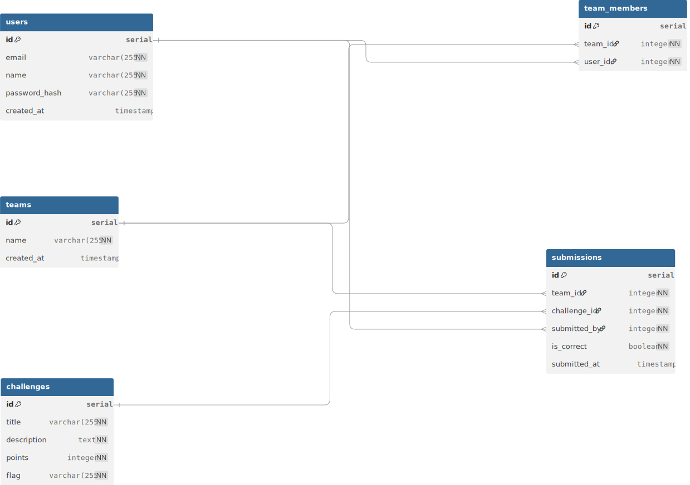

# CodeSprint-26 CTF platform built using Next.js

## Schema of the CTF_platform

## The Theme of the Frontend(Client side styling must be Strictly Black and red)

### the flow is -> simple start with a fun puzzle (thinking of doing a simple rickroll idea to fun it up) -> when cracked go to the registration form -> then let prompt them if they want to create a team or is do they wannna join from a **code** of a team lead -> after handling all this stuff , directly jump into challenge 1,2,3 track the progress and so on 

## Endpoints 
####  /auth endpoint is for the registration of single user
####  /team is the endpoint for team join or create thingy 
